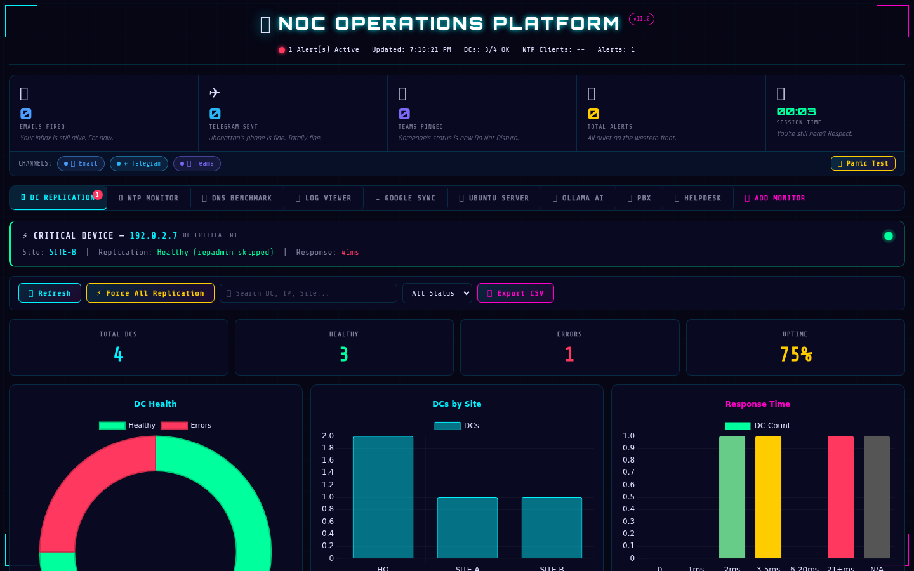
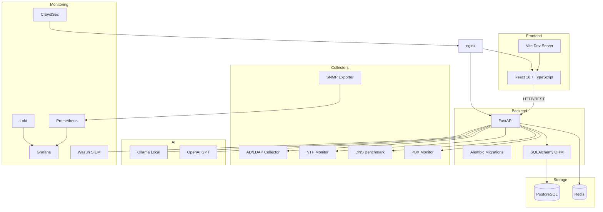

<div align="center">

# ⚡ NexusCore

**Enterprise NOC Platform** — Real-time network operations, AD replication monitoring, AI-powered anomaly detection, and SIEM integration.

[](LICENSE)
[](https://python.org)
[](https://react.dev)
[](https://fastapi.tiangolo.com)
[](https://docker.com)
[](https://postgresql.org)
[](https://github.com/OneByJorah/NexusCore)

</div>

---

<p align="center">
  
</p>

---

## 📋 Overview

NexusCore is a production-grade **Network Operations Center (NOC)** platform built for enterprise environments. It provides real-time visibility into Active Directory replication health, NTP synchronization, DNS resolution, PBX telephony status, and helpdesk ticket metrics — all through a unified, dark-themed dashboard with AI-powered insights via Ollama/OpenAI integration.

| Capability | Description |
|---|---|
| **NOC Dashboard** | Real-time overview of all network operations in a single pane |
| **AD Replication** | Active Directory health across all domain controllers |
| **NTP/DNS/PBX** | Service health with automated alerting and status tracking |
| **Helpdesk** | Ticket metrics, SLA tracking, and status management |
| **AI Insights** | GPT / Ollama integration for intelligent anomaly detection |
| **SNMP Discovery** | Automated network device discovery and inventory |
| **SIEM** | Wazuh integration for security event monitoring |

---

## 🏗️ Architecture



---

## 🛠️ Tech Stack

**Backend** · `FastAPI` · `Python 3.12+` · `SQLAlchemy` · `Alembic` · `PostgreSQL` · `Redis`

**Frontend** · `React 18` · `TypeScript` · `Vite` · `TailwindCSS` · `Recharts`

**AI/ML** · `OpenAI GPT` · `Ollama` (local LLMs: Llama 3.2, Mistral, Phi3)

**Monitoring** · `Prometheus` · `Grafana` · `Loki` · `SNMP Exporter` · `CrowdSec` · `Wazuh`

**DevOps** · `Docker Compose` · `systemd` · `GitHub Actions CI` · `pre-commit` · `ruff`

---

## 🚀 Quick Start

```bash
git clone https://github.com/OneByJorah/NexusCore.git
cd NexusCore

cp .env.example .env          # Configure your services
docker compose up -d          # Launch everything
```

Open **http://localhost:5173** (nginx) in your browser. HTTPS is available on **https://localhost:8443**.

> **Note:** the dashboard UI actually served is the standalone HTML/JS app in
> `frontend/index.html`. The `frontend/src/` React SPA is present but not yet
> wired into the Vite entry point.

### Local Development

```bash
# Backend
cd backend
pip install -r requirements.txt
alembic upgrade head
uvicorn main:app --reload

# Frontend
cd frontend
npm install
npm run dev
```

---

## 🔧 Environment Variables

| Variable | Default | Description |
|---|---|---|
| `OPENAI_API_KEY` | — | OpenAI API key for AI-powered insights |
| `DATABASE_URL` | `sqlite:///./nexuscore.db` | PostgreSQL/SQLite connection string |
| `AD_DOMAIN_CONTROLLER` | — | Domain controller hostname for monitoring |
| `NTP_SERVERS` | — | Comma-separated NTP servers to check |
| `DNS_SERVERS` | — | Comma-separated DNS servers to check |
| `PBX_HOST` | — | PBX server hostname for status monitoring |

See `.env.example` for all available options.

---

## 📁 Project Structure

```
NexusCore/
├── backend/                      # FastAPI application
│   ├── app/
│   │   ├── main.py               # Entry point
│   │   ├── routers/              # API endpoint modules
│   │   ├── config.py             # Settings & DB-backed overrides
│   │   ├── database.py           # SQLAlchemy engine/session
│   │   ├── encryption.py         # Fernet settings encryption
│   │   ├── models.py             # SQLAlchemy models
│   │   └── schemas.py            # Pydantic schemas
│   └── tests/                    # pytest suite
├── frontend/                     # Dashboard UI
│   ├── index.html                # Standalone NOC dashboard (vanilla JS, served UI)
│   └── src/                      # React SPA sources (not wired into Vite entry yet)
├── admin-service/                # Admin utilities service
├── agent/                        # Monitoring agents (Windows)
├── alembic/                      # Database migrations
├── monitoring/                   # Prometheus, Loki, SNMP exporter configs
├── nginx/                        # Reverse proxy configs
├── docs/                         # Documentation, assets & screenshots
├── scripts/                      # Utility scripts
├── database/                     # DB init scripts
├── systemd/                      # systemd service units
├── docker-compose.yml            # Production deployment
└── .env.example                  # Configuration template
```

---

## 📡 API Endpoints

| Endpoint | Method | Description |
|---|---|---|
| `/api/dashboard/overview` | GET | NOC dashboard overview metrics |
| `/api/dc_status` | GET | AD domain controller replication status |
| `/api/dc/forcerepl` | POST | Force AD replication request |
| `/api/ntp_status` | GET | NTP client synchronization health |
| `/api/pbx/status` | GET | PBX service health |
| `/api/pbx/snmp/walk` | GET | Mitel SNMP walk results |
| `/api/helpdesk/tickets` | GET/POST | Helpdesk ticket metrics (osTicket) |
| `/api/wazuh/status` | GET | Wazuh SIEM connection status |
| `/api/ollama/chat` | POST | AI-powered insights (Ollama) |
| `/api/admin/users` | GET/POST | User administration (admin role) |
| `/metrics` | GET | Prometheus metrics |
| `/healthz` | GET | Liveness probe |

---

## 🤝 Contributing

Contributions welcome! Please see [CONTRIBUTING.md](CONTRIBUTING.md) for guidelines and [CODE_OF_CONDUCT.md](CODE_OF_CONDUCT.md) for community standards.

All contributions follow the [Code of Conduct](CODE_OF_CONDUCT.md).

## 🔒 Security

Found a vulnerability? Please follow our [Security Policy](SECURITY.md) and report privately to **info@jorahone.com** — do not use public issues.

---

## 📄 License

[MIT License](LICENSE) © Jhonattan L. Jimenez (OneByJorah)

---

<p align="center">
  Built with 🌴 by <a href="https://github.com/OneByJorah">OneByJorah</a> ·
  <a href="https://jorahone.com">jorahone.com</a>
</p>
