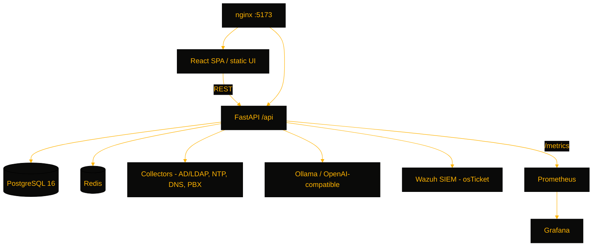

# NexusCore

> An enterprise NOC platform — unified monitoring for AD replication, NTP, DNS, PBX telephony, and helpdesk tickets, with AI-assisted insights and Wazuh SIEM integration, for infrastructure teams running on-premises.

[](https://github.com/OneByJorah/NexusCore)
[](https://github.com/OneByJorah/NexusCore)
[](https://github.com/OneByJorah/NexusCore/stargazers)
[](https://github.com/OneByJorah/NexusCore/commits)


## What This Is

NexusCore consolidates the core signals an enterprise NOC watches — Active Directory replication, NTP synchronization, DNS resolution, PBX health, and helpdesk tickets — into one dark operations dashboard. It layers AI-assisted anomaly triage via a local Ollama model, Wazuh SIEM status, and a full Prometheus/Grafana/Loki observability path. Built for infrastructure teams that need a single pane of glass deployed entirely on-prem with Docker Compose.

## Quick Start

```bash
git clone https://github.com/OneByJorah/NexusCore.git
cd NexusCore
cp .env.example .env   # set SECRET_KEY, POSTGRES_PASSWORD, REDIS_PASSWORD
docker compose up -d
```

Dashboard on `http://localhost:5173`, Grafana on `:3000`, Prometheus on `:9090`. Replace every placeholder secret in `.env` before exposing the stack.

## Features

- Real-time NOC overview of all monitored services in one pane
- AD domain-controller replication status with a force-replication action
- NTP (Chrony) sync status, client list, and DNS benchmarking
- Mitel PBX service health plus SNMP walk results
- osTicket helpdesk ticket listing and creation
- AI insights via local Ollama or OpenAI-compatible endpoints
- Wazuh SIEM agent, alert, and overview queries
- Admin onboarding — users, roles, tabs, encrypted settings, first-run setup API
- Prometheus metrics, Grafana dashboards, Loki logs, CrowdSec, SNMP exporter
- Schema managed exclusively through Alembic migrations

## Architecture



## Stack

FastAPI, Python 3.12+, SQLAlchemy, Alembic, PostgreSQL 16, Redis, React 18, TypeScript, Vite, TailwindCSS, Recharts, Ollama, Prometheus, Grafana, Loki, Wazuh, CrowdSec, SNMP Exporter, Docker Compose, nginx

## Contributing

Contributions are welcome — see [CONTRIBUTING.md](CONTRIBUTING.md) and [open an issue](https://github.com/OneByJorah/NexusCore/issues).

## License

MIT — see [LICENSE](LICENSE).
